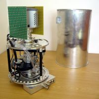

# COLORES01
[Colores Spectrograph](https://www.iaa.csic.es/sites/default/files/thesis/Jeli%C2%ADnek,%20Martin.pdf) control electronics. 

COLORES stands for Compact Low Resolution Spectrograph. It is a spectrograph designed to be lightweight enough to be carried by the high-speed robotic telescope 60cm BOOTES-2/Telma. The instrument makes use of a high speed Electron Multiplying CCD, which permits up to 10 full frames per second. The primary scientific target of the spectrograph is a prompt GRB followup, particularly for the estimation of redshift.

The system is a miniaturized FOSC (faint object spectrograph and camera), a multi-mode instrument that can switch from imaging a field (target selection and precise pointing) to spectroscopy by rotating wheel-mounted grisms, slits and filters within an otherwise fixed optical system.
The filters and the grisms (only one is mounted at the moment) are located in standard filter wheels and the optical design is comprised of a four-element refractive collimator and an identical four-element refractive camera. As a spectroscope, the instrument can use different slits to match the atmospheric seeing, and different grisms in order to select the spectral resolution according to the need of the observation. 

